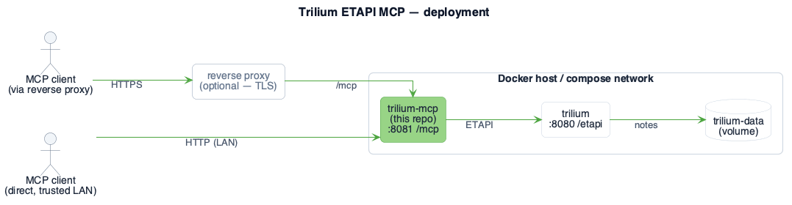
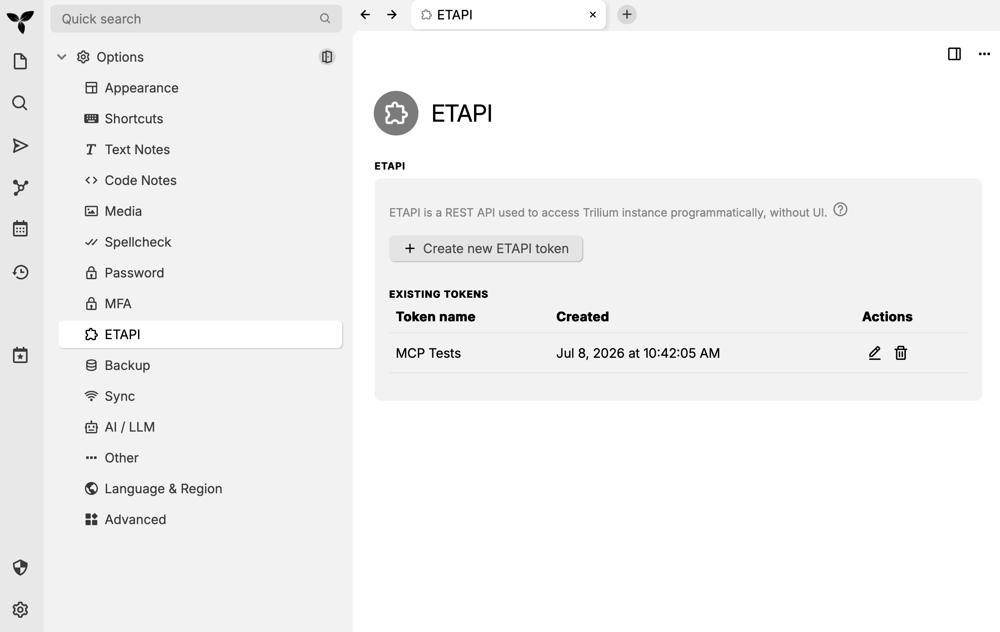
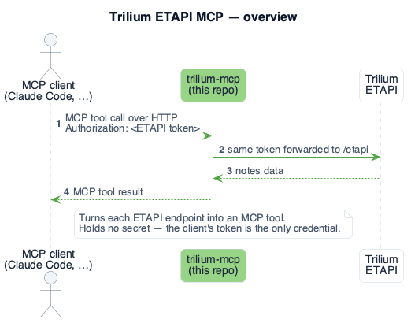
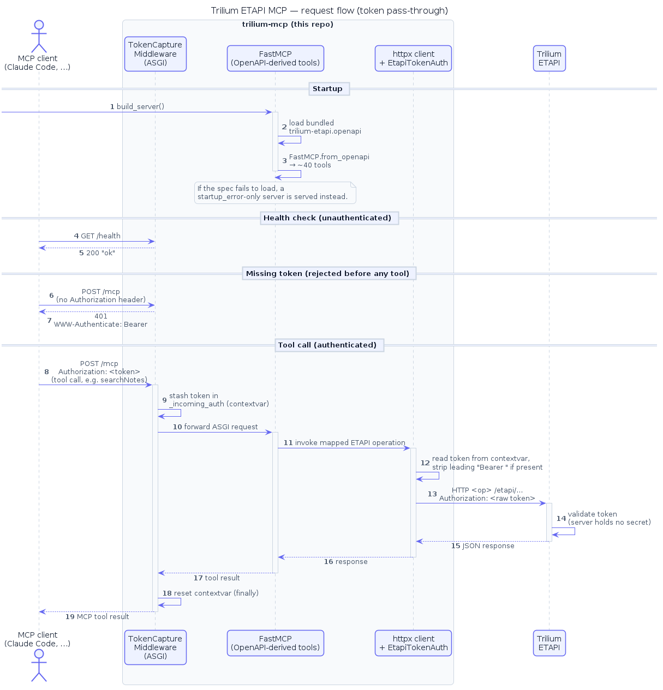

<p align="center">
  
</p>

<h1 align="center"><a href="https://github.com/MarcelBruckner/trilium-mcp">Trilium ETAPI MCP server</a></h1>

A standalone [MCP](https://modelcontextprotocol.io) server that exposes the
[Trilium](https://triliumnotes.org) [ETAPI](https://github.com/TriliumNext/Trilium)
(External API) as MCP tools. It runs as a **container sidecar** next to your Trilium
instance: nearly every documented ETAPI endpoint is turned into an MCP tool at startup
via `FastMCP.from_openapi` (**all 38 tools** — `createNote`, `getNoteById`, `searchNotes`,
`exportNoteSubtree`, …; the auth session endpoints `login`/`logout` are excluded),
served over streamable **HTTP** so any MCP client connects to it by URL.

## Contents

- [Contents](#contents)
- [Architecture](#architecture)
- [Quick start](#quick-start)
- [Connecting a client](#connecting-a-client)
- [Configuration](#configuration)
- [TLS / reverse proxy](#tls--reverse-proxy)
- [Security](#security)
- [How it works](#how-it-works)
- [Alternatives](#alternatives)
- [Layout](#layout)
- [Contributing](#contributing)

## Architecture

<p align="center">
  
</p>

**trilium-mcp** (this repo) runs as a container sidecar and talks to Trilium over the internal
Docker network, so Trilium's ETAPI is never exposed publicly on its own. Clients reach trilium-mcp
either through a TLS-terminating reverse proxy or directly over a trusted LAN — in both cases the
ETAPI token they present is the only credential.

## Quick start

**1. Create an ETAPI token in Trilium** — *Options → ETAPI → Create new ETAPI token*.
This token is the only credential: trilium-mcp stores no secret and forwards the raw token
straight through to Trilium. Each client presents its own token per request.

<p align="center">
  
</p>

**2. Add trilium-mcp to your Trilium's `docker-compose.yaml`** — one service, pulling the
prebuilt image, so there's nothing to clone or build:

```yaml
services:
  trilium:
    # ... your existing Trilium service ...

  trilium-mcp:
    image: ghcr.io/marcelbruckner/trilium-mcp:latest
    container_name: trilium-mcp
    restart: unless-stopped
    environment:
      # Service name of your existing Trilium on the same compose network.
      TRILIUM_SERVER_URL: http://trilium:8080
    ports:
      - "8081:8081"
```

Then start it:

```bash
docker compose up -d trilium-mcp
```

Both services share the compose network, so `trilium` resolves to your existing container. If
your Trilium runs elsewhere (a separate compose project or host), point `TRILIUM_SERVER_URL` at a
URL this container can reach and attach it to the right network — see [Configuration](#configuration).
The MCP endpoint is then available at `http://localhost:8081/mcp`.

**3. Connect your MCP client** with the token from step 1:

```bash
claude mcp add trilium --scope user --transport http \
  http://localhost:8081/mcp \
  --header "Authorization: YOUR_TRILIUM_ETAPI_TOKEN"
```

Your client now has the Trilium tools. See [Connecting a client](#connecting-a-client) for
remote hosts, multiple instances, and `.mcp.json`.

## Connecting a client

The ETAPI token is the credential — pass it in the `Authorization` header. Point the URL at
wherever trilium-mcp is reachable (a TLS reverse proxy, or the container directly on a trusted LAN):

```bash
# Behind a reverse proxy (TLS)
claude mcp add trilium --scope user --transport http \
  https://your-host/mcp \
  --header "Authorization: YOUR_TRILIUM_ETAPI_TOKEN"

# Directly over a trusted LAN (plain HTTP), by IP or hostname
claude mcp add trilium --scope user --transport http \
  http://192.168.1.50:8081/mcp \
  --header "Authorization: YOUR_TRILIUM_ETAPI_TOKEN"
```

Register **multiple instances** by repeating with a different URL + token; each deployment uses
the same image and is bound to one Trilium via `TRILIUM_SERVER_URL`:

```bash
claude mcp add trilium-work --scope user --transport http \
  https://work-host/mcp \
  --header "Authorization: WORK_TOKEN"
```

The `--scope user` flag registers the server across **all** your projects, which is usually what
you want for a personal knowledge base. Drop it to fall back to `claude mcp add`'s default **local**
scope — available only to you in the current project:

```bash
claude mcp add trilium --transport http \
  http://localhost:8081/mcp \
  --header "Authorization: YOUR_TRILIUM_ETAPI_TOKEN"
```

The raw token is what Trilium's ETAPI expects. A `Bearer ` prefix is also accepted (it is
stripped before the request is forwarded), so `Authorization: Bearer YOUR_TOKEN` works too.

Alternatively, use the provided [`.mcp.json`](.mcp.json), filling in your host and token.

## Configuration

All configuration is via environment variables:

| Variable             | Default               | Purpose                                                                                                  |
| -------------------- | --------------------- | -------------------------------------------------------------------------------------------------------- |
| `TRILIUM_SERVER_URL` | `http://trilium:8080` | Base URL of the Trilium instance (`/etapi` is appended automatically).                                   |
| `MCP_HOST`           | `0.0.0.0`             | Interface the MCP server binds to.                                                                       |
| `MCP_PORT`           | `8081`                | Port the MCP server listens on.                                                                          |
| `MCP_PATH`           | `/mcp`                | HTTP path the MCP endpoint is served at.                                                                 |
| `TRILIUM_ETAPI_SPEC` | bundled spec          | Override the OpenAPI spec path.                                                                          |
| `MCP_ALLOWED_HOSTS`  | *(unset = any)*       | Comma-separated `Host` allowlist (DNS-rebinding protection). Unset accepts any Host; set it to restrict. |

## TLS / reverse proxy

The container serves plain HTTP on `:8081`; terminate TLS at your reverse proxy.
Example Caddyfile:

```
your-host {
    reverse_proxy mcp:8081
}
```

## Security

The MCP endpoint grants **full read/write access to your notes**. Every request must
carry a valid Trilium ETAPI token in the `Authorization` header; requests with no
`Authorization` header at all are rejected with `401` before reaching any tool. The
server never validates the token itself — validity is enforced by Trilium when the
forwarded request reaches the actual ETAPI call, and the server holds no secret of its
own. The `/health` endpoint is always unauthenticated (used by the container
healthcheck).

The token is sent in the `Authorization` header on every call. Over plain HTTP it travels
in cleartext, so either keep traffic on a **trusted network** (e.g. a LAN or the Docker
network) or put TLS in front — the Caddy reverse proxy above terminates TLS so the token
never crosses an untrusted hop. Direct `http://<lan-ip>:8081` access is fine on a network
you trust.

By default the server accepts requests for **any** `Host` (FastMCP's DNS-rebinding
protection is disabled), so it can be reached by LAN IP or by the domain your reverse proxy
forwards. To lock this down, set `MCP_ALLOWED_HOSTS` to a comma-separated list of the
host[:port] values you actually use (e.g. `192.168.1.50:8081,trilium.example.com`);
`localhost` is always allowed, and anything else gets a `421`.

If the OpenAPI spec cannot be loaded at startup, the server still starts and completes
the MCP handshake, but exposes only a single `startup_error` tool describing how to fix
it (rather than failing with an opaque connection error).

## How it works

At a glance, trilium-mcp forwards the client's ETAPI token straight through to Trilium:

<p align="center">
  
</p>

<details>
<summary>Detailed sequence (startup, auth gate, token pass-through)</summary>

<p></p>

Startup builds the tools from the OpenAPI spec, the middleware rejects any request without an
`Authorization` header, and the token is carried per request from the middleware to the outgoing
ETAPI call:

<p align="center">
  
</p>

</details>

## Alternatives

Other open-source Trilium/TriliumNext MCP servers exist. Most are stdio subprocesses that
connect a single local client to one Trilium using a token baked into the environment or a
config file. trilium-mcp is instead **HTTP-native** and forwards each client's token
**per request**, so a single sidecar can serve many clients — each presenting its own token —
while storing no secret of its own. (Like the others, one sidecar fronts one Trilium, set via
`TRILIUM_SERVER_URL`; run one per instance.) Its tools are also **generated from the ETAPI
OpenAPI spec** (full endpoint coverage) rather than hand-written.

| Project                                                                             | Language   | Transport           | Token handling                                                            | Tools                           | Docker image         | Latest activity |
| ----------------------------------------------------------------------------------- | ---------- | ------------------- | ------------------------------------------------------------------------- | ------------------------------- | -------------------- | --------------- |
| **trilium-mcp** (this)                                                              | Python     | Streamable **HTTP** | Per-request `Authorization` pass-through (many clients, no stored secret) | **~40**, generated from OpenAPI | Yes (sidecar + GHCR) | active          |
| [tan-yong-sheng/triliumnext-mcp](https://github.com/tan-yong-sheng/triliumnext-mcp) | TypeScript | stdio               | Env var, baked in                                                         | 11, hand-written                | Yes (GHCR)           | Mar 2026        |
| [paerrin/trilium-mcp-server](https://codeberg.org/paerrin/trilium-mcp-server)       | Node.js/TS | stdio               | Config file, multi-instance                                               | 24, hand-written                | No                   | Jan 2026        |
| [radonx/mcp-trilium](https://github.com/radonx/mcp-trilium)                         | JavaScript | stdio               | Env var, baked in                                                         | 4, hand-written                 | No                   | Aug 2025        |

**Maintenance** (as of July 2026): [tan-yong-sheng/triliumnext-mcp](https://github.com/tan-yong-sheng/triliumnext-mcp)
is the most active and popular (≈63 stars, last commit March 2026), though it labels itself a
prototype. [paerrin/trilium-mcp-server](https://codeberg.org/paerrin/trilium-mcp-server) saw a
short burst of releases (Dec 2025 → v0.1.7 in Jan 2026) and has been quiet since. [radonx/mcp-trilium](https://github.com/radonx/mcp-trilium)
has had no commits since August 2025 (~3 commits total, 1 star) and **appears abandoned**.

## Layout

```
Dockerfile               builds the MCP server image (uv-based)
.mcp.json                example MCP client config
app/
  server.py              the MCP server (OpenAPI-driven, HTTP transport, token pass-through)
  pyproject.toml         dependencies
  uv.lock
  trilium-etapi.openapi  bundled Trilium ETAPI OpenAPI spec
```

## Contributing

For local development there's a ready-to-run stack — a throwaway Trilium seeded
with the default demo notes plus the MCP server built from local source
(`docker compose up -d --build`). See [CONTRIBUTING.md](CONTRIBUTING.md) for the
dev setup, seed-instance credentials, and how to run the tests.
